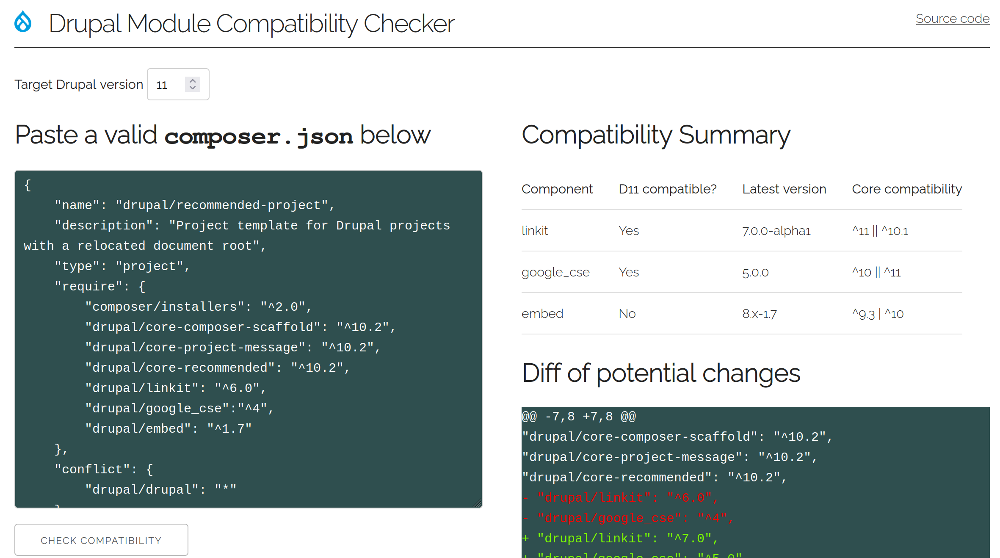

# Module compatibility checker

## Question
> How can I find out if all my contrib modules are compatible with the latest core version?

- https://drupal.stackexchange.com/questions/314360/how-can-i-find-out-if-all-my-contrib-modules-are-compatible-with-the-latest-core
- https://drupal.stackexchange.com/questions/294458/how-do-i-fetch-versions-of-a-module-compatible-with-latest-core-version

## Answer
Use https://module-compatibility-checker.markfullmer.com to get a module compatibility report for any target version Drupal core by inputting your site's `composer.json` file.

## Rationale

Drupal core [releases new major versions](https://www.drupal.org/about/core/policies/core-release-cycles/release-process-overview) every two years. Developers tasked with maintaining a fleet of different sites need a way to audit each site's dependencies for upgrade compatibility. They need to be able to check the status periodically. And they need to be able to do this at scale.

Enter https://module-compatibility-checker.markfullmer.com

## Under the hood

This simple auditing tool uses the Update Status endpoint, https://www.drupal.org/drupalorg/docs/apis/update-status-xml, to quickly get core version compatibility information for modules.
